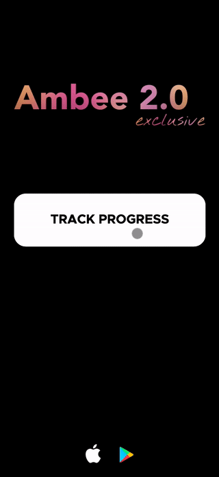

# Sign up to track progress of Ambee 2.0 development

#### Goldee users

**Emails sent** &nbsp; &nbsp; &nbsp; &nbsp; &nbsp; &nbsp; &nbsp; &nbsp; ->&nbsp; &nbsp; &nbsp; &nbsp; &nbsp; &nbsp; **Opens** &nbsp; &nbsp; &nbsp; &nbsp; &nbsp; &nbsp; &nbsp; &nbsp; &nbsp; &nbsp;-> &nbsp; &nbsp; &nbsp; &nbsp; &nbsp;&nbsp; &nbsp; &nbsp; &nbsp; &nbsp; &nbsp; &nbsp; **Clicks** &nbsp; &nbsp; &nbsp; &nbsp; &nbsp; &nbsp; -> &nbsp; &nbsp; &nbsp; &nbsp; &nbsp; &nbsp; **Registrations**

    1 830           33%        596          6.3%           28(1.5%)    32%     9(0.5%)  
    
#### Ambee users (part 1)

**Emails sent** &nbsp; &nbsp; &nbsp; &nbsp; &nbsp; &nbsp; &nbsp; &nbsp; ->&nbsp; &nbsp; &nbsp; &nbsp; &nbsp; &nbsp; **Opens** &nbsp; &nbsp; &nbsp; &nbsp; &nbsp; &nbsp; &nbsp; &nbsp; &nbsp; &nbsp;-> &nbsp; &nbsp; &nbsp; &nbsp; &nbsp;&nbsp; &nbsp; &nbsp; &nbsp; &nbsp; &nbsp; &nbsp; **Clicks** &nbsp; &nbsp; &nbsp; &nbsp; &nbsp; &nbsp; -> &nbsp; &nbsp; &nbsp; &nbsp; &nbsp; &nbsp; **Registrations**

    48 351          9.6%      4 454          10%         449(0.9%)     24%     106(0.2%)  
    

#### Ambee users (part 2)

**Emails sent** &nbsp; &nbsp; &nbsp; &nbsp; &nbsp; &nbsp; &nbsp; &nbsp; ->&nbsp; &nbsp; &nbsp; &nbsp; &nbsp; &nbsp; **Opens** &nbsp; &nbsp; &nbsp; &nbsp; &nbsp; &nbsp; &nbsp; &nbsp; &nbsp; &nbsp;-> &nbsp; &nbsp; &nbsp; &nbsp; &nbsp;&nbsp; &nbsp; &nbsp; &nbsp; &nbsp; &nbsp; &nbsp; **Clicks** &nbsp; &nbsp; &nbsp; &nbsp; &nbsp; &nbsp; -> &nbsp; &nbsp; &nbsp; &nbsp; &nbsp; &nbsp; **Registrations**

    36 197         10.5%     3 816         9.6%         365(1.0%)     27%     65(0.2%)  
    
 
